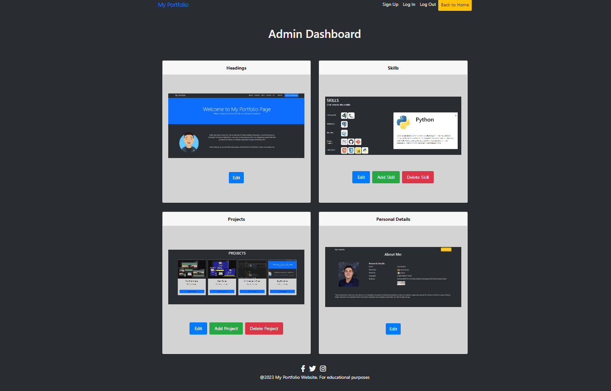

<br>

# Aron's Personal Portfolio Webpage
<br>
<br>


<br>

### Hello and welcome to my portfolio page!
<br>

[Please click here](https://aron-portfolio.herokuapp.com/) to view the deployed page. 
<br>
<br>
**PLEASE NOTE Images and data might have been updated since the writing of this README. You might see screenshots containing different images below, however the general structure of the page remains identical to the visuals that this README depicts.

<br>


## Table of content:

- [Motivation](#motivation)

- [User Experience](#user-experience-ux)
    - [User Stories](#user-stories)
    - [Website Goals](#website-goals)
    - [Requirements](#requirements)
    - [Features](#features)
    - [Expectations](#expectations)
    - [Design](#design)
    - [Wireframes](#wireframes)
    - [Workflow](#workflow)
- [Website Structure](#website-structure)
- [Technology, Frameworks and Programs used](#technology-frameworks-and-programs-used)
    - [Languages](#languages)
    - [Frameworks and programs used](#frameworks-and-programs-used)
- [Features](#features)
- [Testing](#testing)
    - Manual Testing
    - Bugs
    - Automatic Testing
- [Testing user stories](#testing-user-stories)
- [Deployment](#deployment)
- [Credits](#credits)

# Motivation

The motivation behind creating this webpage is to introduce and showcase myself as a web developer to prospective employers and anyone the Web Development sector interested in learning more about my past and current programming knowledge & achievements.

# User Experience (UX)

## User Stories
- User Stories:
    - As a user, I want to be able to access a user-friendly main page showcasing an overview of the developer.
    - As a user, I want to be able to navigate to the About section.
    - As a user, I want to be able to navigate to the Skills section.
    - As a user, I want to be able to navigate to the Projects section.
    - As a user, I want to access the developer's past projects via provided links.
    - As a user, I want to be able to have access to relevant Social Media and GitHub account.
    - As a user, I want to be able to download the developer's CV.
    - As a user, I want to be able to contact the developer via a form.

- Admin Stories:
    - As an admin, I want to be able to access an 'admin-dashboard' panel/page.
    - As an admin, I want to be able to select various sections of the webpage to create, update and/or delete information
    - As an admin, I want to be able to securely log in to the admin dashboard pages.
    - As an admin, I want to be sure that no-ne of the general public will be allowed to access any of the admin pages.
    - As an admin, I want all the changes I make to display on the webpage accordingly for the public to view.

## Website Goals

This webpage aims to serve as an informational web application to showcase personal information, Software Development Skills & Languages as well as a list of prior projects done to the user (such as prospective employers) interested in finding out about me and my coding history. It will also give the user the ability to connect with the site owner (myself) via a form, get access to relevant Social Media and GitHub accounts as well as the ability to download a .PDF CV on request. Finally, the site will aim to provide the administrative front-en access to create, update and/or delete data within certain fields for the site administrator(s) securely access.


## Requirements

- Landing Page.
- About Section.
- Skills Section
- Projects showcase Sectio.
- Contact Section
- Download CV.
- Links to Social Media and GitHub
- Login Access for Admin in where to change/modify/update/delete data in certain fields.

## Expectations

- I expect my website to be easily accessible.
- I expect my website to attract future employers.
- I expect to showcase my projects and skills.
- I expect my website to be editable on the front-end via logging in to an admin account.

# Technology, Frameworks and Libraries used.

## Languages used:

- [HTML](https://en.wikipedia.org/wiki/HTML5) 

- [CSS](https://en.wikipedia.org/wiki/CSS)

- [Python](https://en.wikipedia.org/wiki/Python_(programming_language))

- [JavaScript](https://en.wikipedia.org/wiki/JavaScript)

## Frameworks, Databases and Libraries used:

- [Django](https://www.djangoproject.com/) Python-based web framework that follows the model–template–views architectural pattern.

- [Heroku](https://www.heroku.com) Deployment of website.

- [PostgreSQL](https://www.postgresql.org/) Database storing all schemas and data.

- [ElephantSQL](https://www.elephantsql.com/) For hosting all PostgreSQL data on cloud.

- [Cloudinary](https://cloudinary.com/) Image storage.

- [Gunicorn](https://en.wikipedia.org/wiki/Gunicorn) HTTP server interface.

- [Bootstrap](https://getbootstrap.com/) Bootstrap 5 was used in this project.


## Other Technologies Used:

- [Balsamiq](https://balsamiq.com/) Wireframes.

- [Draw.io](https:/draw.io/) For creating flowcharts.

- [Favicon](https://favicon.io/favicon-generator/) Favicon generator.

- [Psycopg](https://wiki.postgresql.org/wiki/Psycopg) Postgres database adaptor.

- [Allauth](https://django-allauth.readthedocs.io/en/latest/installation.html) For administrator authentication.

- [Devicon](https://www.devicon.dev/) All icons used in 'Skills' section.

- [Flaticon](https://www.flaticon.com/) For icons used in website.


# Features

- Responsive on all devices.
- Interactive buttons.
- Updatable information displayed in each relevant section
- Google Map and Email Form for location and contact
- Downloadable CV.
- Custom front-end admin panel.
- Cloudinary picture storage.

## Design

This site was designed mainly by making use of bootstrap. I downloaded a specific template from [Bootswatch.com](https://bootswatch.com/) called 'Superhero'.
<br>

Colors schema for this site is blue, white and dark grey, with buttons in the 'admin-pages' ranging between blue, yellow, green and red.
<br>

# Data Structure

## Database 

- Personal Details:

    | Object | Field |
    |---|---|
    | ID | is automatically generated |
    | full_name | CharField |
    | nationality | CharField |
    | residency | Charfield |
    | flag_nationality | ImageField |
    | flag_residency | ImageField |
    | languages | Charfield |
    | studying | CharField |
    | study_icon | ImageField |

- Headings:

    | Object | Field |
    |---|---|
    |  ID | is automatically generated |
    | big_heading | CharField |
    | sub_heading | CharField |
    | profile_image | ImageField |
    | par_1 | CharField |
    | par_2 | CharField |

- Project:

    | Object | Field |
    |---|---|
    |  ID | is automatically generated |
    | name | CharField |
    | desription | CharField |
    | image | ImageField |
    | github_url | URLField |

- SkillsCategory:
    | Object | Field |
    |---|---|
    | name | CharField|

- Skills:

    | Object | Field |
    |---|---|
    |  ID | is automatically generated |
    | name | CharField |
    | icon | URLField |
    | progress | ImageField |
    | category | ForeignKey (SkillsCategory) |


# Workflow

## Wireframes

- Home page Top.
    <details><summary>Headings</summary>
    
    </details>
    <br>

- Skills Section.
    <details><summary>Skills</summary>
    
    </details>
    <br>

- Projects Section.
    <details><summary>Projects</summary>
    
    </details>
    <br>


- Admin-CRUD page.
    <details><summary>Edit/Add/Delete pages</summary>
    
    </details>
    <br>

- Admin-Dashboard Section.
    <details><summary>Picture</summary>
    
    </details>
    <br>

- About Me page.
    <details><summary>Picture</summary>
    
    </details>
    <br>


## Home Page Workflow


<br>


<br>

### SKILLS Section Workflow


<br>

# Navigation

<br>

## HOME PAGE

<details>
  <summary>Headings</summary>

  HEADINGS | PC | TABLET | PHONE
  :---:|:---:|:--:|:--:
  'Headings' Section which will be the first thing the user sees when opening the page |  | | 

</details>

<br>

<details>

  <summary>Skills</summary>

  SKILLS | PC | TABLET | PHONE
  :---:|:---:|:--:|:--:
  'Skill' Section which displays current skills and an info-modal |  | | 

</details>

<br>

<details>
  <summary>Projects</summary>

  PROJECTS | PC | TABLET | PHONE
  :---:|:---:|:--:|:--:
  'Project' section displaying all my current projects |  | | 

</details>

<br>

<details>
  <summary>Contact</summary>

CONTACT | PC | TABLET | PHONE
  :---:|:---:|:--:|:--:
  'Contact' section where user can find and contact me |  | | 

</details>

<br>

## ABOUT ME PAGE
<br>

<details>
  <summary>About Me</summary>

ABOUT ME | PC | TABLET | PHONE
  :---:|:---:|:--:|:--:
  'About Me' page where user can get more personal info |  | | 

</details>

<br>

## ADMIN DASHBOARD (FOR ADMINISTRATORS)
<br>
-  <b>IMPORTANT NOTICE</b> : I have made a very active decision, for security purposes, not to display any login features or include the below-mentioned 'Admin Dashboard' button to be seen by any public users. This site was specifically made only for me as the administrator (or anyone who I give authority) to have access to the admin-dashboard. Public users should not be able to explore/view front-end admin access in order to minimize risk of malicious behaviour.

<br>

- For those who have authorisation/access to the administrative panel of this page, where all front-end modification occurs, an 'Admin Dashboard button will appear in the top-navbar once logged into the Django Admin panel.
<br>

- To do this the administrator will have to type in the site url followed by /admin.
<br>

- Once the admin is logged in from there, a blue 'Admin Dashboard button will appear which gives them access to the dashboard. when they redirect to the front end.

<br>

<details>
  <summary>Public User --> Django Admin Login --> Admin-Access</summary>

PUBLIC USER | DJANGO LOGIN | ADMIN ACCESS |
  :---:|:---:|:--:|
    | | 
</details>
<br>
From the 'Admin Dashboard' button, the administrator will then have access to edit/add/delete information on the front end as shown below.

<details>
  <summary>Admin Dashboard</summary>

 PC | TABLET | PHONE
  :---:|:---:|:--:
  | | 

</details>

<br>

## CRUD FUNCTIONALITY (Create, Read, Update, Delete)
<br>

The pages below demonstrate how the user (if admin) can access the admin-dashboard on the page's front-end and to then get access to seperate pages included with forms to add, update/edit and/or delete information, henceforth to be refered to as 'CRUD-pages'. This was done by constructing various forms, views and models to handle creation, augmentation and deletion on the front-end. It will bring them to the admin page.
<br>

PLEASE NOTE: Below I will use one example for each section to demostrate CRUD capabilities. This is to prevent mass repetitiveness and to not flood the section with multiple images of each seperate page doing the exact same function. However, feel free to read the code files to explore more if you wish, specifically 'views.py' to see how each CRUD function is operating.

<br>

SUMMARY OF HOW EACH MODEL CAN BE AUGMENTED:
<br>
- Headings: Edit/Update
- Skills: Add, Edit/Update, Delete
- Projects: Add, Edit/Update, Delete
- Personal Details: Edit/Update

<br>

### CREATE

<br>

<details>
  <summary>Add (Skills)</summary>

 DESCRIPTION | ADD SKILL | NEW SKILL ADDED
  :---:|:---:|:--:
A form is included in the page displaying all inout fields of the 'skills model'. Upon completion of the form, the user can then click to add a new skill| | 

</details>

<br>

### READ
<br>

The 'Read' functionality is already performed and demostrated above by the user's ability to read/view all pages on multiple devices, and will therefore be omitted from this section. The READ capability is demonstrated in the 'Page Navigation' section above.

<br>

### EDIT/UPDATE

<br>

<details>
  <summary>Edit/Update (Headings)</summary>

 DESCRIPTION | EDIT HEADING | UPDATED
  :---:|:---:|:--:
  A form is included in the page displaying all input fields of the 'headings model'. Upon updating the chosen information within the form, the user can then click to edit a part of the section| | 

</details>

<br>

### DELETE 

<br>

<details>
  <summary>Delete (Project)</summary>

 DESCRIPTION | DELETE PROJECT | DELETED
  :---:|:---:|:--:
  A form is included in the page displaying all input fields of the 'projects model'. Upon completion of the form, the user can then click to add a new project| | 
</details>

<br>

# TESTING
<br>

## Manual Testing
<br>

Manual testing was done to make sure all features were performing as intended. Visuals/Proof of each working feature can be viewed upon navigating to the site [here](). Administrative CRUD capabilites/features can be seen handled in the CRUD subjection of the 'Navigation' Section here above.
<br>

### Features and User Stories tested
<br>
All means of testing here was done manually. Visual/Static features can be seen in deployed page. Funtional/Dynamic Features can be seen in CRUD sub-section of 'Navigation' section above.

- Navigation bar takes user to various sections and pages upon request - &#x2705;
<br>
- Home Page performs animated text and image rendering upon page load - &#x2705;
<br>
- Skills Section has animated icons of skills, each opening dynamic modal displaying each skills info when clicked - &#x2705;
<br>
- Project Section displays all my projects, with links to deployed site and repo, and showing unique info on hover -  &#x2705;
<br>
- Contact Section shows my location -  &#x2705;
<br>
- Contact Section has form linked to my email to send me messages - &#x274C; (Form was added but not yet linked due to time constraints)
<br>
- CV Section has a button to download my CV in .pdf format - &#x2705;
<br>
- Admin Dashboard on the front end can be accessed (by admin only), once logged into Django admin panel - &#x2705; (admin button appears in the homepage navbar)
<br>
- Admin Dashboard gives access to all CRUD pages - &#x2705;
<br>
- CRUD pages performs their respective functions successfully on the front end - &#x2705;
<br>
- 'About Me' Page can be accessed for further info and personal details - &#x2705; &#x274C; (Visible but not yet styled perfectly due to time constraints)
<br>

## Automated Testing

- Code Institute Pylinter tool for validating python code
<br>
<details><summary>models.py</summary>

</details>
<br>
<br>
<details><summary>views.py</summary>

</details>
**PLEASE NOTE: the three errors shown above in views.py is only cosmetic, and does not affect functionality
<br>
<br>
<details><summary>forms.py</summary>

</details>
**PLEASE NOTE: the two errors shown above in forms.py is only cosmetic, and does not affect functionality
<br>
<br>
- W3Schools CSS Validator
<br>
<details><summary>Deployed app tested</summary>

</details>

## BUGS

### Caught and Fixed:

- Database error: Migrarions out of sync.
    [#73](https://github.com/Aron-M/Project-4-Portfolio/issues/73)
- Django Admin Login Error.
    [#2](https://github.com/users/Aron-M/projects/2?pane=issue&itemId=26361315)
- Applicatrion error when deploying to Heroku.
    [#4](https://github.com/users/Aron-M/projects/2?pane=issue&itemId=26377040)
- Could not display data to html templates.
    [#8](https://github.com/users/Aron-M/projects/2?pane=issue&itemId=26938068)
- Constant overflowing of 'Status Container'.
    [#58](https://github.com/users/Aron-M/projects/2?pane=issue&itemId=31759107)
- Bootstrap styling & local files doesnt render on deployed app.
    [#74](https://github.com/Aron-M/Project-4-Portfolio/issues/74)
<br>
 
### Caught Exceptions:
<br>
These bugs do not affect the core functionality of the page, but needs to be fixed. They were not yet resloved due to time constraints
<br>

- Allauth imported login/logout pages not styled.
    [#40](https://github.com/users/Aron-M/projects/2?pane=issue&itemId=31752563)

    <br>

- CRUD Pages linked to 'Admin-Dashboard' not properly styled for tablet and mobile view
    - You can see the CRUD subjection within the 'Navigation' section, that tablet and mobile views are visible, but not properly styled for a cleaner look. This was due to time constraints and I left it because me as admin will be the only person making use of those pages.


# Deployment

## Programs needed:


### Cloudinary

1. Create an account [here](https://cloudinary.com/).
2. Log in.
<details><summary>Go to Dashboard for info</summary>


</details>
<br>


### Heroku

3. Create an account [here](https://www.heroku.com/)

### GitHub

4. Login to your [GitHub](https://github.com/)


### ElephantSQL

5. Create an account [here](https://www.elephantsql.com/).
<br>
6. Log in and set up instance
<details><summary>Start creating an instance</summary>

</details>
<br>
<details><summary>Select Plan</summary>

</details>
<br>
<details><summary>Choose Region</summary>

</details>
<br>
<details><summary>Create Instance</summary>

</details>
<br>
<details><summary>Select new Instance</summary>

</details>
<br>
<details><summary>Copy instance URL</summary>

</details>
<br>
## Local Development

7. Go to Github repo [here](https://github.com/Aron-M/Project-4-Portfolio) and click the **< CODE >** button, then click **COPY**.
   <details><summary>Copy My URL</summary>
   
   </details>
   <br>

8. Go to your github repositories and create your own new repository. You can call it whatever you like. Press **Create Repository** and it will lead you to a new page. Press **Gitpod**  and it should open a new workspace for you. 
 ***If you are using VSCODE, then just open a new workspace***
<details><summary>Steps to deploy new workspace</summary>


</details>
<br>

9. When eitherGitpod or VSCODE is open, type in 'git bash' following "**git clone https://github.com/Aron-M/Project-4-Portfolio.git**" (The URL you copied earlier) without using any quotation marks, and press enter. It will clone my repository.
<details><summary>Picture</summary>


</details>
<br>

10. Very good! Now you should have your own local repository with all the neccessary code templates to run the game. In the terminal you can type "python3 run.py" to test the game within your local terminal. Next up we have to deploy it on Heroku.


11. Download all libraries and frameworks to use in this project.
```
pip3 install -r requirements.txt
```

12. Create **env.py** in main folder and add cloudinary api key, elephantSQL and your own secret key. See image below. (DO NOT name the **env.py** file anything differen, or your password will be leaked to your repository.)
```
os.environ['DATABASE_URL'] = " url from elephantsql"
os.environ['SECRET_KEY'] = "secret_key"
os.environ['CLOUDINARY_URL'] = "api key from, remove 'CLOUDINARY_URL=' FROM BEGINING"
```
<details><summary>env.py</summary>

</details>
<br>

13. Now type in this command into terminal, this will migrate all models to database.
```
python3 manage.py migrate
```
<details><summary>Migrating files</summary>

</details>
<br>

14. Now we have to create 'superuser' for django admin panel from within the terminal by typing command:

```
python3 manage.py createsuperuser
```
<details><summary>Create Superuser in CLI</summary>

</details>
<br>

15. Go to pp4_portfolio folder and open **settings.py** and add this code to **ALLOWED_HOST**
```
.herokuapp.com, localhost
```


16. Now we push our code to GitHub by typing:
```
git add .
git commit -m "your own commit"
git push
```
17. Go to [Heroku](https://id.heroku.com/login) and login to your account.

18. At the top right corner click the **New** button and then **Create new app**, next you will
- Name your app whatever you like, then 
- Pick server depending which region you are in: For me it was Europe 
- Then click **Create app**
    <details><summary>Picture</summary>
    
    
    </details>
    <br>

19. Go to **Settings** and press **Reveal Config Vars**. In the **KEY** block type in **PORT** and for **VALUE** type in **8000**.
    <details><summary>Picture</summary>
    
    </details>
    <br>

Additonally, aslo add the following config variables
```
DATABASE_URL - url as is in env.py
SECRET_KEY - your secret key
CLOUDINARY_URL - API key as is in env.py
```

20. Now scroll down until you see **Buildpacks**, press **Add buildpack** and select **python** and **save changes**. Afterwards, again **Add buildpack** but this time pick **nodejs** and **save change**. heroku/python should be above nodejs. If its not, then drag it with the hamburger menu on the left of the image or remove with x and add again in the correct order.
    <details><summary>Picture</summary>
    
    </details>
    <br>

21. Go back to top of the page and click **Deploy**, and click on **GitHub** and connect to it. Next below type in name of your repository and click search, it should automaticaly find the repo. Then click **Connect**
    <details><summary>Picture</summary>
    
    
    </details>
    <br>

22. Now in address bar type in after our website url **/accounts/login** and input your superuser password. If everything works you should see frontend admin panel.
```
https://........herokuapp.com/accounts/login/
```
<details><summary>Django Admin Panel</summary>

</details>
<br>

23. Project is now ready to be used.
<br>


# Credits:

- My mentor [Simen Daelin](https://github.com/Eventyret) who has been very helpful in directing and guding me.
<br>

- Youtube Videos for guiding me on how to make a modal, writing relevant views, animating texts and fading in images
<br>

    - [Florin Pop](https://www.youtube.com/watch?v=XH5OW46yO8I) for modal assistance.
    - [GreatStack](https://www.youtube.com/watch?v=qEcXe51-ZTw) & [DarkCode](https://www.youtube.com/watch?v=5lo_QdeWm_g) for guiding me in animating text.
    - [SimpliCode](https://www.youtube.com/watch?v=27aMG1e5CIQ) for assistance in fading images in.
    - [CodeEntrepeneurs](https://www.youtube.com/playlist?list=PLEsfXFp6DpzRMby_cSoWTFw8zaMdTEXgL) 'TryDjango' tutorials 30 to 39 for extra guidance on how to create views and urls.
    <br>
<br>

- [Bootswatch.com](https://bootswatch.com/) for use of 'SuperHero' template.
<br>

- [Flaticon](https://www.flaticon.com/search?author_id=1&style_id=136&type=standard&word=student) for use of icons
<br>

- [Code Institute Pylinter](https://pep8ci.herokuapp.com/#) to validate my Python code.
<br>

- [W3Schools](https://jigsaw.w3.org/css-validator/) for validating CSS code
<br>

- [DevIcons](https://devicon.dev/) for use of 'skills' icons.
<br>

- [Bootstrap Documentation](https://getbootstrap.com/docs/4.1/getting-started/introduction/) in guiding me how to utilize Bootstrap effectively.
<br>

- [Django Documentation](https://docs.djangoproject.com/en/4.2/) guiding me how to implement models, views and forms effectively.
